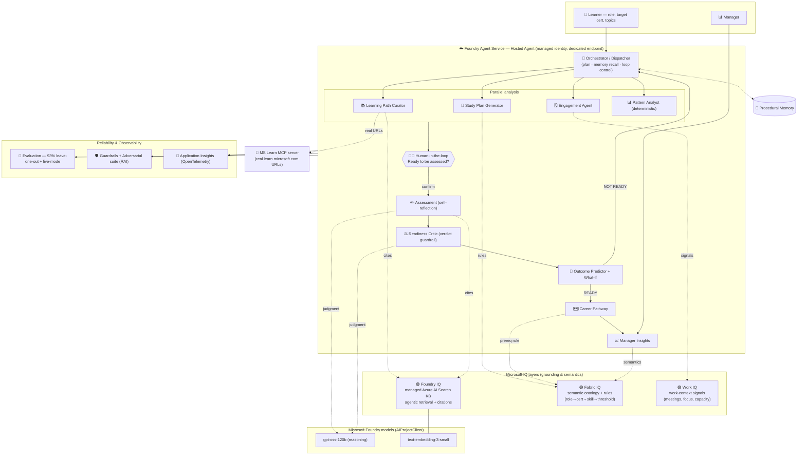

# 🏗️ CertForge — Architecture

How CertForge uses **Microsoft Foundry** end to end: a Hosted Agent on Foundry
Agent Service runs an 8-agent reasoning pipeline, grounded by all three Microsoft
IQ layers, calling Foundry models, with evaluation, Responsible-AI guardrails, and
Application Insights observability.

### Legend
- **Hosted Agent** (Foundry Agent Service): the entry agent + 8 sub-agents, deployed
  as a container with a managed Entra identity and a dedicated endpoint.
- **Foundry IQ**: managed Azure AI Search knowledge base — Curator & Assessment
  retrieve cited passages via the `knowledge_base_retrieve` MCP tool (managed-identity auth).
- **Fabric IQ**: the semantic ontology (entities, relationships, business rules)
  driving planning, the prerequisite/readiness rules, and manager insights.
- **Work IQ**: work-context signals → study windows, capacity-risk, adaptive reminders.
- **Models**: `gpt-oss-120b` (agent reasoning) + `text-embedding-3-small` via the
  unified `AIProjectClient`.
- **Reliability**: leave-one-out + live-mode evaluation, Responsible-AI guardrails +
  adversarial safety suite, and OpenTelemetry → Application Insights.

> Provider-agnostic by design: the same code runs on GitHub Models (`LLM_PROVIDER=github`)
> and falls back to a deterministic mock engine — demo-safe with no hard dependency.
