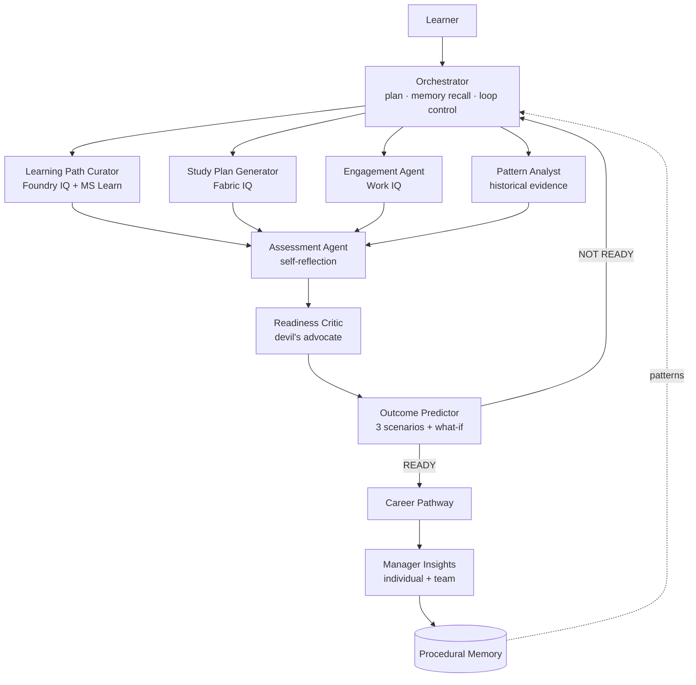

# 🎓 CertForge

**A self-improving, multi-agent enterprise certification-intelligence system.**
Built for the Agents League — **Reasoning Agents track (Microsoft Foundry)**.

CertForge helps organisations run team certification programmes. Eight specialised
agents plan, engage, assess, **debate**, predict, **loop**, and learn — grounded in
Microsoft IQ layers and procedural memory. It doesn't just answer *"are you ready?"*
— it **argues the case from evidence**, **predicts the outcome**, simulates **what-if**
scenarios, and **gets smarter with every learner**.

> ⚠️ **Synthetic data only.** All learners, work signals, and documents are
> fabricated (`L-1001`, `EMP-001`, `TEAM-A`). No real people, no PII. Demonstration only.

---

## What it does (the scenario)

A learner picks a target certification. CertForge:
1. Recalls patterns from previous learners (procedural memory).
2. Curates a cited learning path and a capacity-aware study plan.
3. Reads work signals to find realistic study windows and flag capacity risk.
4. Generates grounded, cited practice questions and scores readiness.
5. **Critiques** the result adversarially using historical evidence.
6. **Predicts** pass/borderline/fail with a live what-if simulator.
7. If not ready, **loops** — re-plans weak areas and re-assesses (max 3×).
8. If ready, recommends the next certification (career pathway).
9. Surfaces a **manager dashboard** with a team risk heatmap.

---

## Architecture



The four agents under the Orchestrator run in parallel; the reasoning agents run
sequentially. A **feedback loop** re-plans weak areas and re-runs
Assessment→Critic→Predictor (max 3 iterations) until READY or loops exhausted.

### Agents

| Agent | Role | Engine | Grounding |
|-------|------|--------|-----------|
| Orchestrator | Plan, recall memory, control the loop | deterministic | Procedural Memory |
| Learning Path Curator | Map cert → cited modules | deterministic + retrieval | Foundry IQ |
| Study Plan Generator | Capacity-aware schedule | deterministic | Fabric IQ |
| Engagement Agent | Study windows + capacity risk | deterministic | Work IQ |
| Pattern Analyst | Pass/fail patterns + what-if coefficients | **deterministic (by design)** | Foundry IQ + Fabric IQ |
| Assessment Agent | Cited questions + self-reflection | **LLM** | Foundry IQ + Fabric IQ |
| Readiness Critic | Challenge claims with evidence | **LLM (verdict guardrailed)** | all upstream |
| Outcome Predictor | 3 weighted scenarios + what-if model | deterministic | Pattern Analyst |
| Manager Insights | Individual report + team dashboard | deterministic | Work IQ + Fabric IQ |

**Hybrid by design:** the LLM does *judgment* (arguing, writing questions); code
does *math* (statistics, probabilities). The Pattern Analyst is deliberately
deterministic so its numbers are trustworthy, not an LLM's guess.

### Capability layers
1. **Feedback loop** — re-plans and re-runs the reasoning chain (max 3×).
2. **What-If simulator** — live pass-probability recompute as you change hours/exams/slot.
3. **Career pathway** — next-certification preview when READY.
4. **Team batch mode** — process a whole team into a manager dashboard.
5. **Reasoning trace viewer** — every agent's decision chain, inspectable.

### Reasoning patterns
Planner–Executor · Critic/Verifier · Self-reflection · Role specialisation · Feedback loop.

---

## Microsoft IQ integration

- **Microsoft Learn MCP server** — the Curator calls Microsoft's public MS Learn
  MCP server ([learn_mcp.py](certforge/src/learn_mcp.py)) to fetch **real
  learn.microsoft.com URLs** per skill (live mode; falls back to constructed URLs
  offline). A genuine Model Context Protocol tool integration.
- **Foundry IQ** — a knowledge base over approved synthetic docs
  (`knowledge/*.md`) with **real semantic retrieval** ([retriever.py](certforge/src/knowledge/retriever.py)):
  documents are chunked, embedded, and matched by cosine similarity, returning
  **cited passages**. The Curator and Assessment agents cite real retrieved
  content. *Production note:* the retriever interface swaps to a managed Azure
  Foundry IQ knowledge base (Azure AI Search) without changing the agents — see
  **Azure status** below.
- **Fabric IQ** — the semantic model ([semantic_model.json](certforge/data/semantic_model.json)):
  role → certification → skills → recommended hours → pass threshold → prerequisite.
- **Work IQ** — work signals ([work_signals.json](certforge/data/work_signals.json)):
  meeting/focus hours, preferred slot, team, manager.

---

## LLM provider (Microsoft Foundry)

**CertForge runs natively on Microsoft Foundry** (`LLM_PROVIDER=azure`). Agent
reasoning uses **`gpt-oss-120b`** and retrieval embeddings use
**`text-embedding-3-small`**, both deployed in a Foundry project and called
through the unified `AIProjectClient` → `get_openai_client()` with keyless Entra
auth (`az login`). The client transparently unwraps the reasoning model's JSON
envelope and falls back to mock on any failure.

The provider is **swappable**: set `LLM_PROVIDER=github` to run on
[GitHub Models](https://github.com/marketplace/models) (`gpt-4o-mini`, free) with
no other code changes — useful for fast, offline-friendly iteration. Both paths
are fully implemented in [llm.py](certforge/src/llm.py).

---

## Reliability & Safety

- **Evaluation harness** ([evaluate.py](certforge/src/evaluation/evaluate.py)) —
  **leave-one-out validation** against actual exam outcomes:
  **accuracy 0.93, precision 1.00, recall 0.89, F1 0.94 (14/15)**,
  plus groundedness, output-guardrail, and **per-role fairness** checks.
- **Responsible-AI guardrails** ([guardrails.py](certforge/src/safety/guardrails.py)) —
  input gate (blocks PII / non-synthetic IDs / unknown certs), output validation
  (verdict/score bounds, probability sums, citation presence), a transparency
  notice, and a **deterministic verdict guardrail** bounding the LLM's decision.
- **Telemetry** ([telemetry.py](certforge/src/telemetry.py)) — per-agent latency,
  an append-only JSONL trace, and an OpenTelemetry-shaped span helper.

---

## Hosted deployment (Foundry Agent Service)

CertForge **is deployed and running as a Hosted Agent in Foundry Agent Service**
(Canada Central, status *active*, own Entra identity). The agent entrypoint
([agent/main.py](certforge/agent/main.py)) implements the documented **Responses**
and **Invocations** protocols on port 8088. The hosted agent runs Assessment +
Critic on **`gpt-oss-120b`** via its managed identity. Full walkthrough, endpoints,
and engineering notes: **[DEPLOY.md](DEPLOY.md)**.

```bash
# invoke the live hosted agent
azd ai agent invoke certforge "Analyze EMP-001 for AZ-204" -o raw
# -> HTTP 200, engine: azure:gpt-oss-120b

# or run the agent locally (same code)
python certforge/agent/main.py   # http://localhost:8088
curl -X POST http://localhost:8088/responses -d '{"input":"Analyze EMP-001 for AZ-204"}'
```

## Running locally

```bash
# from the repo root
python3 -m venv .venv && source .venv/bin/activate
pip install -r certforge/requirements.txt

# 1. copy env template and add your GitHub token (Models: read permission)
cp .env.example certforge/.env
#    edit certforge/.env -> GITHUB_TOKEN=github_pat_...

# 2. run the tests (mock mode, offline)
CERTFORGE_MOCK=true python -m pytest certforge/tests/ -q

# 3. run the evaluation report (from inside certforge/)
cd certforge && CERTFORGE_MOCK=true python -m src.evaluation.evaluate && cd ..

# 4. launch the dashboard
streamlit run certforge/src/ui/app.py
```

### Mock vs. live
`CERTFORGE_MOCK` in `certforge/.env` controls the engine:
- `true` (default) — all agents deterministic. No network, instant, demo-safe.
- `false` — Assessment + Critic call the LLM (GitHub Models); retrieval is semantic.
  Falls back to mock automatically on any LLM failure.

---

## Project layout
```
certforge/
  data/        synthetic learners / work signals / semantic model
  knowledge/   Foundry IQ knowledge documents (markdown)
  agent/           Hosted Agent entrypoint (Responses + Invocations) + agent.yaml
  src/
    config.py        config + cached data loaders
    llm.py           provider-agnostic LLM client (GitHub Models / Azure)
    telemetry.py     latency + trace logging
    agents/          8 agents + base contract + manager synthesizer
    knowledge/       retriever (semantic search + citations)
    pipeline/        orchestration runner (parallel + sequential + loop)
    memory/          procedural memory store
    safety/          Responsible-AI guardrails
    evaluation/      leave-one-out evaluation harness
    ui/              Streamlit dashboard (4 views)
  tests/             12 regression + safety/eval tests
```

---

## Submission requirement coverage

| Requirement | How CertForge meets it |
|-------------|------------------------|
| Multi-agent system, certification scenario | 8 agents + manager synthesizer |
| Microsoft Foundry / Agent Framework | **Runs on Foundry**: `gpt-oss-120b` + `text-embedding-3-small` via `AIProjectClient`; Hosted Agent (Responses/Invocations); Foundry IQ retrieval |
| Reasoning & multi-step | parallel + sequential + feedback loop + adversarial debate + self-reflection |
| External tools / APIs / MCP | **Microsoft Learn MCP server** (live doc URLs in the Curator); GitHub Models inference + embeddings |
| ≥1 Microsoft IQ layer | **all three**: Foundry IQ, Fabric IQ, Work IQ |
| Synthetic data only | fabricated IDs, no PII; documented |
| Demoable + documented | 4-view Streamlit UI; this README |
| Evaluations / telemetry / Responsible AI (extras) | LOO eval (93%), guardrails, telemetry, fairness |
| Hosted deployment story (extra) | **Live on Foundry Agent Service** (Canada Central, managed identity, `gpt-oss-120b`) — Responses + Invocations agent, `agent.yaml`, [DEPLOY.md](DEPLOY.md) |
